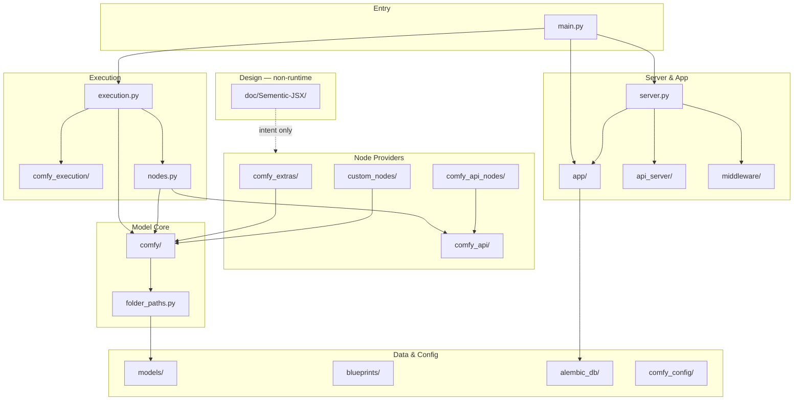

# Module Map

Sementic UI(ComfyUI 코어) 저장소의 최상위 모듈 지도입니다. 의존 방향은 대체로 **위(앱/서버) → 아래(실행/모델)** 입니다.

---

## 의존 관계 개요

---

## 루트 진입점

| 파일 | 책임 | 주요 의존 |
|---|---|---|
| `main.py` | CLI 파싱, 로거·DB·노드 초기화, `PromptServer` 기동, prompt worker 스레드 | `server`, `execution`, `nodes`, `app.*`, `comfy.cli_args` |
| `server.py` | `PromptServer` — aiohttp 앱, WebSocket, HTTP API, 큐, 미들웨어 체인 | `app.*`, `execution`, `middleware`, `comfy_api` |
| `execution.py` | 프롬프트 실행: 그래프 검증, 캐시, 노드 dispatch, OOM/재시도, 진행률 | `comfy_execution/*`, `nodes`, `comfy.model_management` |
| `nodes.py` | 코어 노드 클래스, `NODE_CLASS_MAPPINGS`, custom/api node 로더 | `comfy/*`, `comfy_api/latest` |
| `folder_paths.py` | `models/`, `input/`, `output/`, `temp/` 등 경로·확장자 레지스트리 | `comfy.cli_args` |
| `latent_preview.py` | latent 미리보기(TAESD 등) | `comfy`, `folder_paths` |

---

## `app/` — 애플리케이션 서비스

ComfyUI 서버 위에서 동작하는 **앱 레벨** 기능. HTTP 라우트는 주로 `server.py`와 `app/assets/api/routes.py`에서 등록됩니다.

| 모듈 | 책임 |
|---|---|
| `app/frontend_management.py` | `comfyui-frontend-package` 버전 해석, 커스텀 프론트엔드 경로, `--front-end-version` 처리 |
| `app/user_manager.py` | 멀티 유저 설정, 사용자별 디렉터리 |
| `app/model_manager.py` | 모델 파일 목록·다운로드 UI 연동 |
| `app/custom_node_manager.py` | 커스텀 노드 메타데이터·웹 확장 |
| `app/subgraph_manager.py` | 서브그래프 저장·로드 |
| `app/node_replace_manager.py` | 노드 교체/마이그레이션 매핑 |
| `app/app_settings.py` | 앱 설정 persist |
| `app/logger.py` | 로깅 설정, startup 경고 |
| `app/database/` | SQLAlchemy DB 연결 (`db.py`), 공통 모델 (`models.py`) |
| `app/assets/` | **에셋 관리 서브시스템** (아래 상세) |

### `app/assets/` 상세

| 경로 | 책임 |
|---|---|
| `api/routes.py` | REST: 업로드, 목록, 태그, 메타데이터 필터 |
| `api/upload.py` | 멀티파트 업로드 처리 |
| `api/schemas_in.py`, `schemas_out.py` | Pydantic/API 스키마 |
| `database/models.py` | Asset, Tag, Reference ORM |
| `database/queries/` | asset, tags, metadata, cursor 페이지네이션 |
| `services/ingest.py`, `bulk_ingest.py` | 파일 수집·DB 반영 |
| `services/metadata_extract.py` | EXIF, 차원, MIME 등 추출 |
| `services/tagging.py` | 자동·수동 태그 |
| `services/asset_management.py` | CRUD 오케스트레이션 |
| `services/hashing.py`, `file_utils.py`, `path_utils.py` | 파일 무결성·경로 |
| `scanner.py`, `seeder.py` | output 폴더 스캔, 백그라운드 시드 |

---

## `comfy_execution/` — 실행 엔진 유틸

`execution.py`에서 분리된 **그래프 실행 전용** 모듈.

| 모듈 | 책임 |
|---|---|
| `graph.py` | `DynamicPrompt`, `ExecutionList`, 링크·입력 해석 |
| `graph_utils.py` | `GraphBuilder`, `is_link()` |
| `caching.py` | `BasicCache`, `LRUCache`, `HierarchicalCache`, `RAMPressureCache` |
| `cache_provider.py` | 커스텀 캐시 프로바이더 훅 |
| `validation.py` | 노드 입력 타입 검증 |
| `progress.py` | 노드별 진행률, WebUI 핸들러 |
| `jobs.py` | 잡 상태·큐 보조 |
| `asset_enrichment.py` | 실행 결과에 에셋 메타데이터 부착 |
| `utils.py` | 실행 컨텍스트 (`CurrentNodeContext`) |

---

## `comfy/` — 모델·추론 코어

PyTorch 기반 diffusion 및 멀티모달 모델 구현. 노드는 여기서 제공하는 API를 호출합니다.

| 영역 | 경로 | 책임 |
|---|---|---|
| **CLI·옵션** | `cli_args.py`, `options.py` | 전역 CLI 플래그 |
| **모델 수명** | `model_management.py`, `memory_management.py`, `model_prefetch.py`, `multigpu.py` | VRAM, 디바이스, offload, cuDNN |
| **로딩** | `sd.py`, `diffusers_load.py`, `supported_models.py`, `model_detection.py` | 체크포인트·safetensors 로드, 아키텍처 감지 |
| **패치** | `model_patcher.py`, `patcher_extension.py`, `lora.py`, `weight_adapter/` | LoRA/OFT 등 가중치 어댑터 |
| **샘플링** | `samplers.py`, `sample.py`, `sampler_helpers.py`, `k_diffusion/`, `extra_samplers/` | 스케줄러, KSampler |
| **조건** | `conds.py`, `controlnet.py`, `cldm/` | conditioning, ControlNet |
| **VAE·latent** | `latent_formats.py`, `taesd/` | latent 형식, TAESD 미리보기 |
| **CLIP·텍스트** | `sd1_clip.py`, `sdxl_clip.py`, `text_encoders/` | 텍스트 인코더 (T5, Flux, Hunyuan …) |
| **비전** | `clip_vision.py`, `image_encoders/` | CLIP Vision, SigLIP |
| **LDM** | `ldm/` | UNet/DiT/MMDiT 등 아키텍처별 구현 (Flux, SD3, Wan, Cosmos …) |
| **오디오** | `audio_encoders/` | Wav2Vec 등 |
| **기타** | `hooks.py`, `gligen.py`, `quant_ops.py`, `ops.py`, `utils.py` | 후크, GLIGEN, 양자화, 연산 래퍼 |

`comfy/ldm/`은 모델 패밀리별로 하위 패키지가 나뉩니다 (예: `flux/`, `wan/`, `hunyuan_video/`, `cosmos/`, `lumina/`).

---

## 노드 제공자

### `nodes.py` (코어)

- 이미지 I/O, latent, KSampler, Conditioning, VAE, CheckpointLoader 등 **기본 노드**
- `init_extra_nodes()` — `comfy_extras`, `comfy_api_nodes`, `custom_nodes` 일괄 import

### `comfy_extras/` (~118 파일)

내장 확장 노드. 파일명 패턴 `nodes_<feature>.py`.

| 예시 파일 | 기능 |
|---|---|
| `nodes_flux.py`, `nodes_sd3.py` | 모델별 헬퍼 |
| `nodes_controlnet.py`, `nodes_ipadapter.py` | ControlNet, IPAdapter |
| `nodes_video.py`, `nodes_wan.py` | 비디오 |
| `nodes_audio.py`, `nodes_ace.py` | 오디오 |
| `nodes_train.py` | 학습 관련 |
| `nodes_primitive.py`, `nodes_logic.py` | 프리미티브·로직 |

### `comfy_api_nodes/`

외부 **Comfy API** 파트너 서비스 노드. `apis/`에 OpenAPI 스키마, `nodes_*.py`에 노드 구현.

| 예시 | 제공자 |
|---|---|
| `nodes_openai.py`, `nodes_gemini.py`, `nodes_anthropic.py` | LLM/이미지 API |
| `nodes_kling.py`, `nodes_runway.py`, `nodes_luma.py` | 비디오 |
| `nodes_stability.py`, `nodes_ideogram.py`, `nodes_bfl.py` | 이미지 |
| `nodes_hunyuan3d.py`, `nodes_tripo.py`, `nodes_meshy.py` | 3D |
| `nodes_elevenlabs.py` | TTS |

`--disable-api-nodes` 시 미들웨어가 외부 호출을 차단할 수 있습니다.

### `custom_nodes/`

로컬·서드파티 확장. 각 패키지는 `NODE_CLASS_MAPPINGS`를 export. ComfyUI-Manager가 설치·업데이트를 담당.

---

## `comfy_api/` — 노드 API 버전

커스텀 노드가 상속하는 **공식 Comfy Node API**.

| 경로 | 설명 |
|---|---|
| `latest/` | 현재 권장 API (`io`, `ComfyExtension`, 입력 타입) |
| `v0_0_1/`, `v0_0_2/` | 이전 버전 (하위 호환) |
| `input/`, `input_impl/` | 입력 타입 정의·구현 |
| `internal/` | 내부 등록·버전 관리 |
| `feature_flags.py` | CLI/feature flag 레지스트리 |
| `torch_helpers/` | PyTorch 유틸 |

`nodes.py`와 `comfy_extras`의 신규 노드는 `comfy_api.latest` 기반 `ComfyExtension` 패턴을 사용합니다.

---

## `api_server/`

ComfyUI **내부 전용** HTTP 라우트. `/internal/*`는 외부 앱에서 사용하지 않습니다.

| 경로 | 설명 |
|---|---|
| `routes/internal/` | 내부 디버그·통계·관리 엔드포인트 |
| `services/`, `utils/` | 라우트 헬퍼 |

---

## `middleware/`

aiohttp 미들웨어.

| 모듈 | 역할 |
|---|---|
| `cache_middleware.py` | 정적 자산 Cache-Control |
| (server.py 내 factory) | CORS, origin 검사, API 노드 차단, Manager 미들웨어 |

---

## `comfy_config/`

| 모듈 | 역할 |
|---|---|
| `config_parser.py` | YAML/설정 파싱 |
| `types.py` | 설정 타입 |

---

## `utils/`

| 모듈 | 역할 |
|---|---|
| `extra_config.py` | `extra_model_paths.yaml` 로드 |
| `install_util.py` | 패키지·버전 설치 헬퍼 |
| `mime_types.py` | MIME 초기화 |
| `json_util.py` | JSON 직렬화 유틸 |

---

## 데이터·템플릿·마이그레이션

| 경로 | 역할 |
|---|---|
| `models/` | 학습된 가중치 (git 미포함). `folder_paths`가 서브폴더별 경로 정의 |
| `input/`, `output/`, `temp/` | 런타임 I/O |
| `blueprints/` | 공식 템플릿 워크플로 JSON + `.glsl` 셰이더 |
| `alembic_db/` | Alembic 마이그레이션 (`versions/`) |
| `script_examples/` | API 사용 예제 스크립트 |

---

## `doc/` — 문서·설계

| 경로 | 역할 |
|---|---|
| `doc/wiki/Home.md` | Wiki 홈 |
| `doc/wiki/module-map.md` | 이 문서 |
| `doc/Sementic-JSX/` | Semantic JSX 스펙, CLI (`index.mjs`), 예제 `.sjsx` |

`.sjsx` 파일은 **런타임 의존성 그래프에 포함되지 않습니다**. 설계·합의용 IR입니다.

---

## 테스트·CI

| 경로 | 범위 |
|---|---|
| `tests/` | 실행·서버 통합 테스트 |
| `tests-unit/` | assets, folder_paths, nodes_math 등 단위 테스트 |
| `.github/workflows/` | ruff, 릴리스, PR 검증 |

---

## 실행 시 호출 순서 (요약)

1. `main.py` — 인자 파싱, DB `init_db()`, mime types
2. `start_comfyui()` — `PromptServer` 생성, Manager, `nodes.init_extra_nodes()`
3. `prompt_server.add_routes()` — HTTP/WS 등록
4. `prompt_worker` 스레드 — 큐에서 prompt dequeue
5. `execution.PromptExecutor.execute()` — 그래프 순회, `nodes.NODE_CLASS_MAPPINGS[class_type]` 호출
6. 노드 함수 → `comfy.*` 모델 연산 → 출력을 캐시·WebSocket으로 반환

---

## 모듈 추가 시 체크리스트

| 변경 종류 | 수정할 위치 |
|---|---|
| 새 코어 노드 | `nodes.py` 또는 `comfy_extras/nodes_*.py` |
| 새 API 파트너 노드 | `comfy_api_nodes/nodes_*.py` + `apis/` |
| 새 모델 아키텍처 | `comfy/ldm/<family>/`, `supported_models.py` |
| 새 HTTP API | `server.py` 또는 `app/assets/api/routes.py` |
| 새 모델 경로 | `folder_paths.py`, `extra_model_paths.yaml.example` |
| UI/시스템 설계 의도 | `doc/Sementic-JSX/*.sjsx` |
| Wiki | `doc/wiki/module-map.md`, `Home.md` |

---

## 관련 문서

- [Home.md](./Home.md)
- [Semantic JSX README](../Sementic-JSX/README.md)
- [ComfyUI README](../../README.md)
